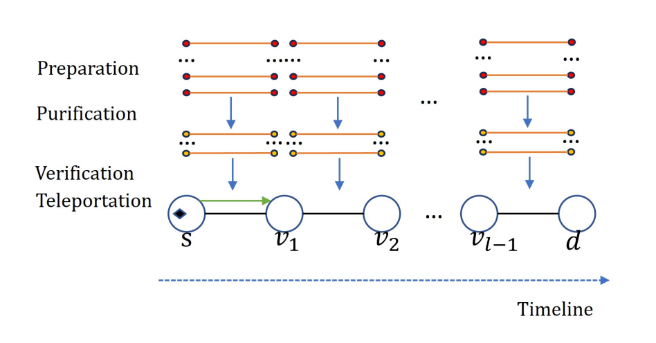

# quantum-similation

Simulate Quantum Network Using Net-Squid

# Goal

Try to implement a transport layer protocol for quantum network using NetSquid.

# Overview

# Protocols

## GenEntanglement

Generate entanglement between two nodes. `entangle.py` is the implementation of this protocol.

The protocol is as follows:

1. Each node will constantly generate entanglement pairs until the specified number of pairs is reached.
2. For each pair of entanglement, the protocol will send the **memory position** and **initial fidelity** to the
   Purification protocol via `self.send_signal()`.
3. Once all paris are generated, the protocol will then wait for the Purification protocol to send a request for
   generating new entanglement pairs.
4. The protocol will then generate new entanglement based on the memory position sent by purification protocol.

## Purification

Purify entanglement between two nodes. `purify.py` is the implementation of this protocol.

The protocol is as follows:

1. The protocol will wait for the GenEntanglement protocol to generate entanglement pairs.
2. Once the entanglement pairs are received, the protocol will record the memory position, calculate the fidelity of the
   entanglement pairs.
3. The protocol will then start purifying the entanglement pairs if at least two entanglement pairs are received and the
   fidelity is below the threshold.
4. The protocol will communicate with entangle node to perform the purification process.
5. Once the purification process is done, the protocol will send a signal to the GenEntanglement protocol to generate
   new entanglement pairs. As each purification process will destroy one entanglement pair.
6. The protocol will then wait for the GenEntanglement protocol to send new entanglement pairs and starts from Step 1.
   This process will repeat
   until the specified number of entanglement pairs is reached with the desired fidelity.
7. Finally, the protocol will send a signal to the Verification protocol to start the verification process (TODO).

## Verification

Need implementation

## Transportation

Need implementation

## TODO

- [ ] Implement two node connection
    - [x] Implement preparation between two nodes
    - [x] Implement purification between two nodes
    - [ ] Implement verification between two nodes
    - [ ] Implement entanglement swapping between two nodes
        - [ ] Implement Teleportation between two nodes